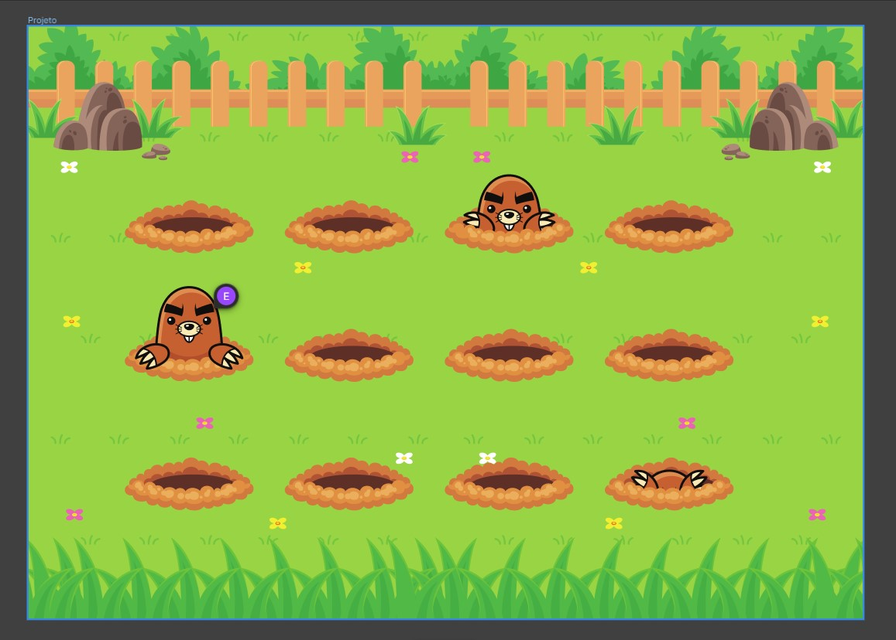

  

  

## 🖥️ Projeto
Esse é um projeto web de onde aplicamos animações no CSS para a movimentações das toupeiras em jardim.

## 🚀 Tecnologias
Esse projeto foi desenvolvido durante o curos de Explore da Rocketsat com as seguintes tecnologias:

-HTML
- CSS
-GIT E GITHUB

## 🏷️layout
Você pode visualizar o layout do projeto através 
[desse link](https://www.figma.com/file/TG8ROxuGXCVVmpW4qRWdve/Wack-a-Mole-(Community)?node-id=0%3A1&mode=dev).
É necessario ter uma conta no [Figma](https://www.figma.com).